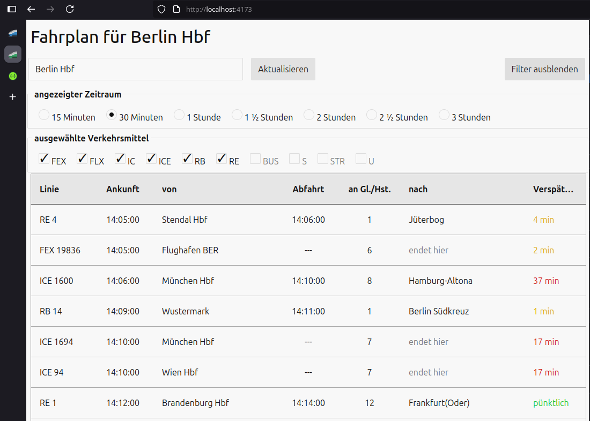

# rr DEV Challenge

A web application for displaying schedule information of public transports.

## Tech Stack
- **Backend**: [NestJS](https://nestjs.com/) (Node.js framework)
- **Frontend**: [SvelteKit](https://svelte.dev/docs/kit/introduction) (reactive HTML framework)

## Installation & Startup

1. **Backend Setup**
```bash
cd server
npm install
npm run build
npm start
```

2. **Frontend Setup**
```bash
cd client
npm install
npm run build
npm run preview
```

The frontend runs on **http://localhost:4173/** and the swagger-ui on **http://localhost:3000/**



<small style="position:absolute; right:0">made from scratch, without copy-paste or AI</small>
